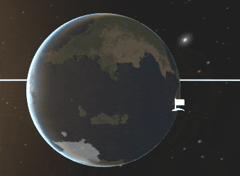

<p align="center">
  <a href="../../releases/latest"></a>
</p>

---

# Tilt'Em

*This mod adds [planetary axial tilt](https://simple.wikipedia.org/wiki/Axial_tilt) for [Kerbal Space Program (KSP)](https://kerbalspaceprogram.com)*

This is a complete and total rewrite of the original Tilt'Em mod! The previous version of tilt'em attempted to use mode switching between the rotating and non-rotating reference frames used by KSP, effectively swapping whether the body was tilted or the planetarium was tilted. However this implementation caused discontinuities at the transition point. This rewrite uses a fixed anchor point upon entry of the rotating reference frame, allowing for continuous entry/exit of the inverseRotating frame.

If you would like to read more about the mathematics of Tilt'Em, you can read about a (somewhat rigorous) formalization [here](Docs/TILT_MATHEMATICS.pdf).

# Installation

1) Go to the [latest release](../../releases/latest) page and download the zip file
2) Decompress the downloaded .zip into your KSP folder
3) If you want to edit the default tilts, you need to install Kopernicus and edit the `GameData\TiltEm\TiltEm.cfg` file. It follows the same rules as any Kopernicus .cfg file


# Usage in game

There's now a new camera control in Map View / Tracking station! By pressing *v* on your keyboard, you'll swap between "Rotation: Pole Up" and "Rotation: System Up".

The former of these is rotates the camera so that the "up" direction is inline with the selected body's North Pole. The latter will walk up the celestial-tree until it hits a star, at which point it'll use the star's tilt or a user defined orbital plane as the up vector.

Both of these are useful in different ways! Don't be afraid to switch between them or use whatever you feel best for your current scenario.

# Mod Developers

### Tilting Bodies
Tilt'em supports two forms of config inputs:
```
poleRA
poleDec
```
or
```
tiltx
tiltz
```

You can kind of think of these two ways of defining orientation as "rotation based" (dec is your phi above the equator, ra is your theta) or "tilt based" (tiltx rocks along the x-axis, tiltz tilts foward and backwards)

These are placed in the body's Properties node, I like to group them with initial rotation as that would be your W parameter by IAU definitions (prime meridian offset)

Traditionally these are measured relative to the "universal reference frame", if you'd like to specify them relative to a parent's pole frame (for example you have some body that's tidally locked) you can set
`tiltRelativeToParent = true` in the body's Properties node.

### Orbits relative to parent
By default, orbital parameters use the universal frame, this can make putting objects at the equator of other objects difficult and tedious, to fix this you can put:
`relativeToParent = true` in the orbit node, this now treats all orbital parameters as if they were being specified as their parent's north pole as zero
Example: Mars's moons are hardly tilted relative to Mars, but are relative to the ecliptic.  `relativeToParent` off -> 26.04 degree inc + some weird LAN fudge numbers, with `relativeToParent` -> 1.093 degrees, much easier to control where you want things to be.

### Orbital Planes
On stars, you can also specify a `orbitalPlaneRA` or `orbitalPlaneDec` / `orbitalPlaneX` or `orbitalPlaneZ` in the Properties node, this allows you to do things like a star with axial tilt with a "favorable planet" as the 0 degree mark, or similar. (Earth is the "favorable planet" in the Sol system, and this is used to set its visual inclination to zero)

---

### Status:

|   Branch   |   Build  |
| ---------- | -------- |
| **master** |[](https://ci.appveyor.com/project/gavazquez/tiltem/branch/master) |

---
